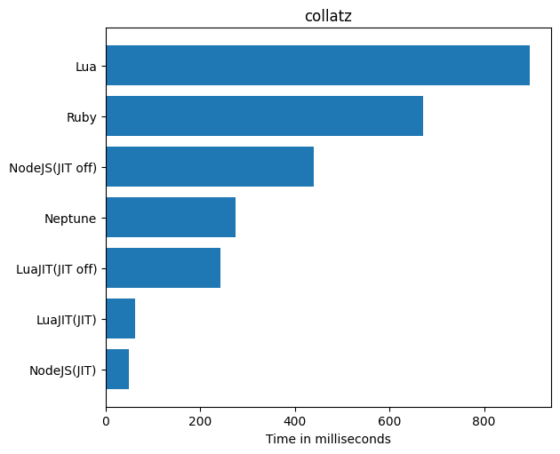
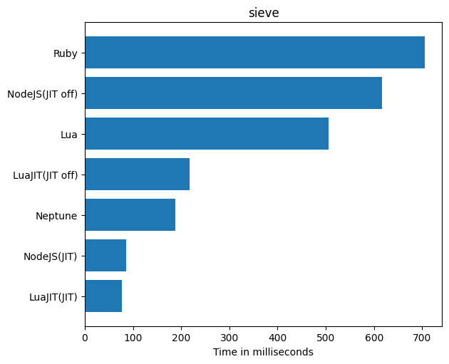

# Benchmarks

These benchmarks were run on an Intel® Core™ i5-1035G1 processor.

## Collatz

## Ackermann

## Binary Trees

## N-Body

## Nested For Loops

## Selection Sort

## Sieve of Eratosthenes

## Spectral Norm

