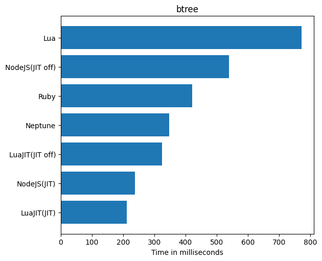
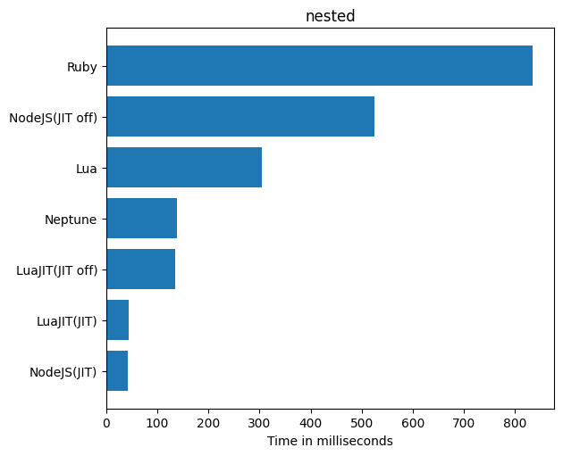
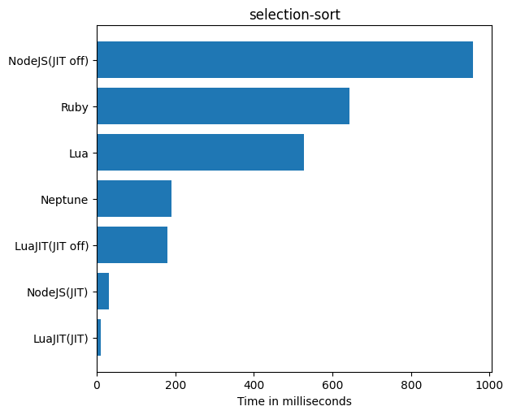
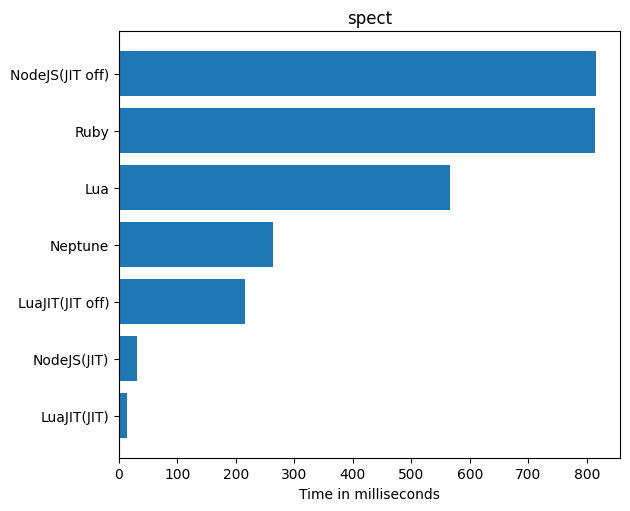

# Benchmarks

These benchmarks were run on Github Actions and are present in the bench directory.

## Geometric Mean of All Benchmarks

## Collatz

## Fibonacci

## Binary Trees

## N-Body

## Nested For Loops

## Selection Sort

## Sieve of Eratosthenes

## Spectral Norm

